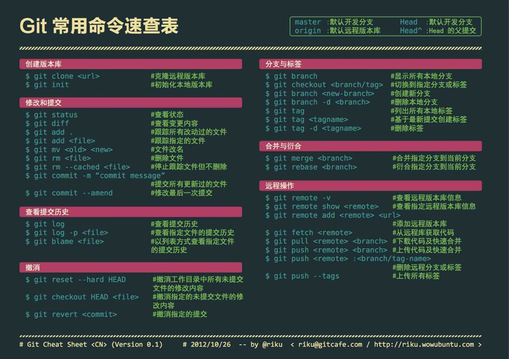

# Git CMD

**查看本地分支**		`git branch`

**查看远程分支**		`git branch -a`

**拉取远程分支**		`git checkout -b location_master origin/master` 

> checkout远程的origin/master分支，在本地起名为location_master分支，并切换到本地的location_master分支

### SSH 配置

**设置user name 和 email**
$ git config --global user.name "humingx"
$ git config --global user.email "humingx@yeah.net"

**生成密钥**
$ ssh-keygen -t rsa -C "mcgrady911@foxmail.com"

**验证密钥**
$ ssh -T git@github.com

### Git常用命令行

